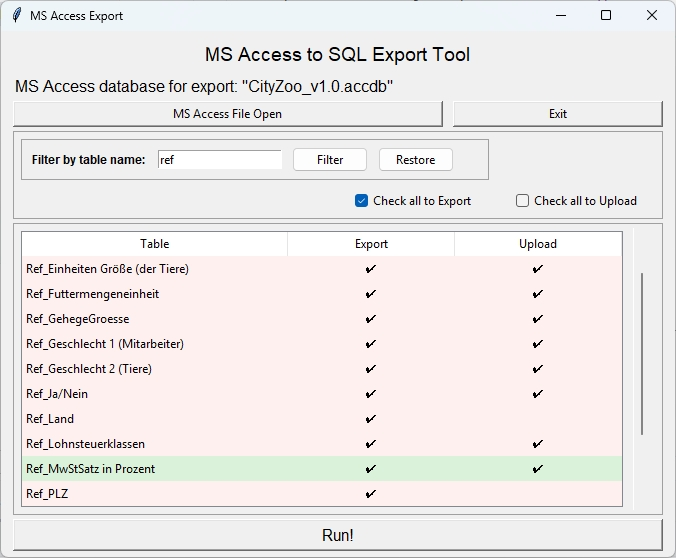

# MS Access to SQL Export Tool

**Easily export MS Access databases to SQL scripts!**

This project provides a Python-based utility to export the structure and data of MS Access databases (`.mdb`, `.accdb`) into an SQL script. The tool ensures the correct handling of table structures, primary keys, and foreign key relationships, allowing for a smooth migration to other SQL-based databases.



## Features

- **Table Structure Export**: Generate `CREATE TABLE` statements with correct data types and constraints.
- **Primary and Foreign Keys**: Automatically extract and define primary and foreign key relationships.
- **Data Export**: Populate SQL scripts with export table data.
- **Substantive Treeview class**: With filtering block via Pandas DataFrame.
- **Quick render class**: Allows rendering of `tk` or `ttk` elements without explicit object definitions.
- **Customizable DAO Integration**: Uses the `DAO.DBEngine.120` driver for precise MS Access database interactions.

## Who Needs This Tool?

This tool is ideal for professionals who deal with MS Access databases and need to migrate, integrate, or back up their data in SQL format:

- **Data Engineers**: Simplify ETL (Extract, Transform, Load) processes by seamlessly incorporating MS Access databases into modern SQL-based systems. See [issue #16](https://github.com/whellcome/MSAccessToSQL/issues/16) for our plans to support command-line execution, making automation even easier.
  
- **Database Administrators**: Save time and effort when exporting complex MS Access databases while maintaining referential integrity. The planned feature for [saving and loading configurations](https://github.com/whellcome/MSAccessToSQL/issues/17) will make repetitive export tasks effortless.
  
- **Developers**: Work with legacy MS Access data using familiar SQL scripts for modern web and software development.

### Related Issues:

1. **[Command-line Execution (#16)](https://github.com/whellcome/MSAccessToSQL/issues/16)**  
   - Automate the export process to support batch jobs and integration with enterprise ETL pipelines. Ideal for organizations heavily reliant on MS Access databases.

2. **[Save and Load Configurations (#17)](https://github.com/whellcome/MSAccessToSQL/issues/17)**  
   - Add functionality to save the current export setup (e.g., database path, selected tables) and reload it in future sessions, enabling quick and consistent operations.

Here’s the "Important" section translated into English:

---

## Install

   ```bash
   git clone https://github.com/whellcome/MSAccessToSQL
   cd MSAccessToSQL
   pip install -r requirements.txt
   ```

### Important

This project relies on the `tkextras` module, which enhances functionality for working with the `tkinter` interface. The `tkextras` module, along with other dependencies, is included in the `requirements.txt` file. 

**Note:** If the `tkextras` module does not install automatically, you can manually install it using the following command:


   ```bash
   pip install git+https://github.com/whellcome/tkextras.git
   ```

## Usage

1. Run the script.
2. Use the file dialog to select your MS Access database file (`.mdb`, `.accdb`).
3. The tool generates an SQL file with the full database structure and data.
4. Review or modify the exported script as needed, then import it into your SQL database.

#### **Important Note: Access Permissions**

To ensure the application functions correctly, read access to the system tables (`MSysObjects` and `MSysRelationships`) in your Access database is required. Without this access, the application will not be able to extract necessary metadata.

**Steps to Grant Permissions:**

1. Open your Access database.
2. Run the following VBA script in the VBA editor (`Alt+F11`):
    ```vba
    Sub GrantPermissions()
        On Error Resume Next
        Dim strDdl As String
        strDdl = "GRANT SELECT ON MSysObjects TO Admin;"
        CurrentProject.Connection.Execute strDdl
        strDdl = "GRANT SELECT ON MSysRelationships TO Admin;"
        CurrentProject.Connection.Execute strDdl
        If Err.Number = 0 Then
            MsgBox "Permissions granted successfully.", vbInformation
        Else
            MsgBox "Failed to grant permissions. Error: " & Err.Description, vbCritical
        End If
    End Sub
    ```
3. Save the changes and re-run the application.

If you do not have access to modify permissions, please contact your database administrator.

## Planned Features

- [x] **Graphical User Interface (GUI)** *(Done)*:  
  - User-friendly interface for non-technical users.  
  - Interactive selection of tables and data to export.

- [x] **Data Integrity Control** *(Done)*:  
  - Include checks and validation to ensure consistent and complete data exports.

- [x] **Advanced Export Options** *(Done)*:  
  - Custom filters for rows and columns.  
  - Selective inclusion or exclusion of relationships and constraints.

## Example SQL Output

The following is a sample SQL snippet generated by the tool:

```sql
-- Table: Ref_Countries
CREATE TABLE 'Ref_Countries' (
  'ID' Integer NOT NULL,
  'Name' Text(255) NOT NULL,
  PRIMARY KEY (ID)
);

-- Filling data for Ref_Countries
INSERT INTO 'Ref_Countries' (ID, Name) VALUES
  (1, 'United States'),
  (2, 'Germany'),
  (3, 'France');
```


## Support and Contributions

We welcome feedback, suggestions, and contributions to make this tool better. If you'd like to contribute, feel free to submit issues or pull requests.

## Buy Me a Coffee

If you find this tool helpful and want to support its development, consider buying me a coffee. ☕

[](https://www.buymeacoffee.com/whellcome)

---

Stay tuned for updates and new features!  🚀
